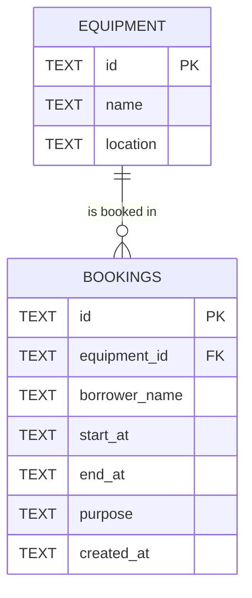

# Campus Equipment Booking API

Midterm Practical Lab Test. A small REST API for booking shared faculty equipment (projectors, cameras, meeting rooms). It prevents the same equipment from being booked for overlapping times.

- **Stack:** TypeScript, Hono, Cloudflare Workers (Wrangler), D1 (local SQLite)
- **Base API URL (deployed on Cloudflare Workers):** `https://booking-api.task-6731503024.workers.dev/api`

Quick check of the live API:

```bash
curl -i https://booking-api.task-6731503024.workers.dev/api/equipment
```

## How to run locally

Requires Node.js 20 or newer.

```bash
npm install
npx wrangler d1 execute booking-db --local --file=./schema.sql
npm run dev
```

The API is then available at `http://localhost:8787/api`.

Note: `schema.sql` drops and recreates both tables, so running it again resets all data and reloads the three sample equipment records.

## How it was deployed

```bash
npx wrangler login
npx wrangler d1 create booking-db        # then put the database_id into wrangler.jsonc
npx wrangler d1 execute booking-db --remote --file=./schema.sql
npm run deploy
```

## How to run the tests

```bash
bash run_tests.sh                              # tests the deployed API
bash run_tests.sh http://localhost:8787/api    # tests a local server
```

The output is saved to `evidence/cloud-test-results.txt`.

## Project files

| File | Purpose |
|---|---|
| `src/index.ts` | All routes, validation, and error handling |
| `schema.sql` | Tables and seed data |
| `wrangler.jsonc` | Worker config and the D1 binding (`DB`) |
| `API_CONTRACT.md` | Endpoints, payloads, status codes |
| `TEST_EVIDENCE.md` | Test cases and results |
| `run_tests.sh` | curl test script (instructor's guide plus extra error cases) |
| `evidence/` | Test output and screenshots |
| `AI_LOG.md` | Record of AI use |
| `QUALITY_GATE_REVIEW.md` | Review findings and fixes |

## Schema / ERD

```
equipment                         bookings
---------------------             ------------------------------
id        TEXT  PK   1 ------ N   id            TEXT  PK
name      TEXT  NOT NULL          equipment_id  TEXT  NOT NULL  FK -> equipment.id
location  TEXT  NOT NULL          borrower_name TEXT  NOT NULL
                                  start_at      TEXT  NOT NULL  (ISO 8601, UTC)
                                  end_at        TEXT  NOT NULL  (ISO 8601, UTC)
                                  purpose       TEXT  NOT NULL
                                  created_at    TEXT  NOT NULL  (default: now)
```



- One equipment item can have many bookings (one-to-many).
- SQLite has no date-time type, so times are stored as ISO 8601 text in UTC (for example `2026-10-20T09:00:00.000Z`). Because every value has the same format, comparing the text gives the correct time order.
- Database columns use `snake_case`; the API uses `camelCase` as the contract requires. `toBooking()` in `src/index.ts` converts between them.

## Business rules

1. All five fields (`equipmentId`, `borrowerName`, `startAt`, `endAt`, `purpose`) must be non-empty strings.
2. `startAt` and `endAt` must be ISO 8601 date-times with a time zone.
3. `startAt` must be before `endAt`.
4. `equipmentId` must exist in the `equipment` table.
5. A booking must not overlap another booking of the same equipment. Two bookings overlap when `existing.start_at < new.endAt AND existing.end_at > new.startAt`.

The same rules run for both create (`POST`) and update (`PATCH`) through one function, `checkBooking()`.

## Assumptions

- **Back-to-back bookings are allowed.** A booking ending at 11:00 and another starting at 11:00 do not conflict.
- **Unknown `equipmentId` returns `404`**, following the brief's rule "404 when a resource is not found". The equipment is a resource that does not exist.
- **`PATCH` is a partial update.** Only the fields sent are changed; the result is validated as a whole. When checking for conflicts, the booking being edited is excluded so it does not conflict with itself.
- Times are normalised to UTC before saving, so `2026-10-20T16:00:00+07:00` is stored as `2026-10-20T09:00:00.000Z`.
- Booking ids are random UUIDs.

## Security notes

- Every SQL statement uses `?` placeholders with `.bind(...)`. Request data is never concatenated into SQL strings, which prevents SQL injection.
- Invalid or malformed JSON returns `400` instead of crashing.
- Unexpected errors return a generic `500` JSON message; internal details are logged on the server only.
- CORS is not enabled, because I test with Postman and curl and do not use a browser-based client.

## Known limitations

- No authentication (not required by the brief).
- The overlap check and the insert are two separate steps, so two requests arriving at exactly the same moment could both pass the check.
- No maximum length on `borrowerName` or `purpose`.
